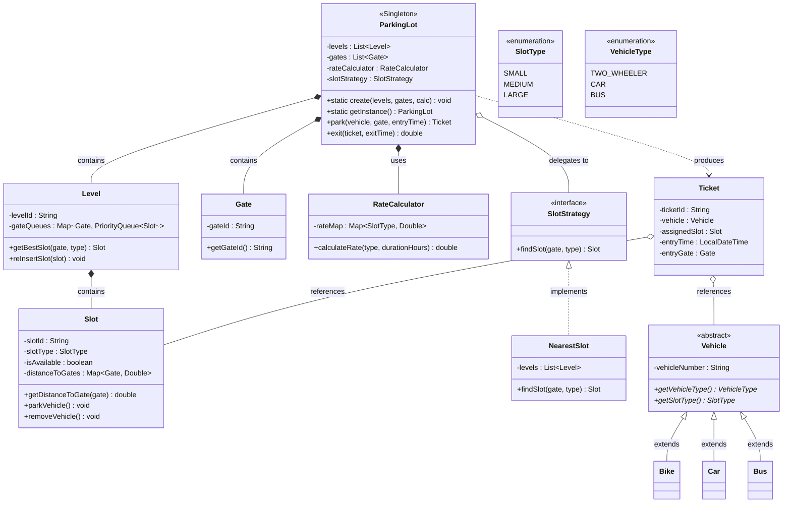

# 🅿️ Multilevel Parking Lot System

A console-based Multilevel Parking Lot system built in **Java**, architected using **SOLID principles**, advanced **design patterns**, and an optimized **Lazy Removal with Priority Queues** strategy to ensure high performance and thread safety at scale.

---

## ✨ Features

- Dynamic infrastructure supporting an arbitrary number of levels and entry gates
- Configurable multiple vehicle types (Bikes, Cars, Buses)
- Two core functionalities:
    - **Park** – Smartly allocates the nearest available slot based on the entry gate
    - **Exit** – Frees the slot and calculates a dynamic fare based on duration
- **Lazy Removal with PriorityQueues** – O(1) average-case slot discovery per gate
- Thread-safe Singleton engine – protected against concurrent access via synchronized blocks

---

## 🚗 System Behaviour

- **Lot Creation** – The system is initialized once with specific levels, gates, and an injected hourly rate map
- **Entering the Lot** – When a vehicle arrives at a gate, the parking logic peeks the top of that gate's PriorityQueue to find the optimal available slot of the required type (Small, Medium, or Large)
- **Slot Allocation** – The slot with the shortest physical distance to the entry gate is assigned; stale occupied slots are lazily removed from the queue on-demand
- **Ticketing** – An immutable ticket is generated containing a unique ID, the exact timestamp, the assigned slot, and the vehicle details
- **Exiting the Lot** – The slot is freed (marked available) and re-inserted into all gate queues via O(log N) heap insertion
- **Fare Calculation** – The exit fare is computed by multiplying the stay duration by the slot-specific hourly rate (minimum charge of 1 hour)

---

## ⚡ Core Algorithm: Lazy Removal with Priority Queues

> *"The secret sauce that makes the system both fast and thread-safe."*

### 1. The Core Challenge: Synchronization

In a standard system, a slot (e.g. `Slot_42`) exists in the PriorityQueue for **every** gate. If a car enters from Gate A and takes `Slot_42`, that slot is still sitting at the top of Gate B's queue.

The naïve solution — manually removing `Slot_42` from every queue on park — is an **O(N)** operation per queue. With 10 gates, that's 10 × O(N) operations, killing throughput.

### 2. The Optimized Logic: "Lazy Removal"

Instead of cleaning up all queues immediately, we clean them only when we actually need them.

**Step-by-Step Execution:**

1. **Parking Request** – A car arrives at Gate A.
2. **The Peek** – The system looks at the top of Gate A's PriorityQueue. It sees `Slot_42`.
3. **The Validity Check** – Before assigning, it checks `slot.isAvailable()`.
4. **The "Lazy" Cleanup:**
    - If `isAvailable` is `false` (taken by Gate B or C), the system polls (removes) it and checks the next element.
    - This repeats until a truly available slot is found.
5. **The Assignment** – Mark `isAvailable = false`, generate the ticket.

### 3. The Exit Logic: Re-insertion

When a vehicle leaves:

1. Set `isAvailable = true`
2. Re-insert the slot into the PriorityQueues for all gates on that level — **O(log N)** per gate
3. Even with 10 gates, 10 × O(log N) is far faster than manual O(N) removal

### 4. Why This Is the Senior Engineer Approach

| Problem | Solution |
|---|---|
| **Search Speed** | Finding the best slot is O(1) on average (just a peek) |
| **Data Consistency** | `isAvailable` boolean acts as the single Source of Truth |
| **System Throughput** | No global queue freeze; only clean what you need, when you need it |

### 5. Time Complexity Summary

| Operation | Complexity |
|---|---|
| Parking (Discovery) | **O(1)** avg · O(K log N) worst (K = stale slots at top) |
| Exiting (Re-insertion) | **O(G log N)** where G = number of gates |

> Even with 5,000 slots across 20 levels, the user at the gate gets their ticket in **milliseconds**.

---

## ⚙️ How It Works

**1. Setup**
`Main.java` defines the physical layout (Gates, Distances, Slots, Levels) and the dynamic pricing map. Dependencies are injected into `ParkingLot` to create the single centralized engine.

**2. Parking a Vehicle**
A vehicle arrives at a `Gate`. `ParkingLot` delegates to the `NearestSlot` strategy, which peeks each level's PriorityQueue for that gate, lazily skipping occupied slots, and returns the closest available one. A secure `Ticket` is returned.

**3. Leaving the Lot**
The client submits their `Ticket` and exit time. The system marks the slot available and re-inserts it into all relevant queues.

**4. Billing**
Entry-to-exit duration is passed to the injected `RateCalculator`, which returns the final fare.

---

## 🏗️ Design Patterns Used

| Pattern | Where Used |
|---|---|
| **Singleton Pattern** | `ParkingLot` engine — Double-Checked Locking with `synchronized` |
| **Strategy Pattern** | `SlotStrategy` interface → `NearestSlot` implementation |
| **Dependency Injection** | `RateCalculator` and `SlotStrategy` injected into `ParkingLot.create()` |
| **Polymorphism** | `Bike`, `Car`, `Bus` extend abstract `Vehicle` |

---

## 📂 Project Structure

```
src/
├── calculator/
│   └── RateCalculator.java
├── model/
│   ├── Bike.java
│   ├── Bus.java
│   ├── Car.java
│   ├── Gate.java
│   ├── Level.java
│   ├── Slot.java
│   ├── SlotType.java       (enum)
│   ├── Ticket.java
│   ├── Vehicle.java        (abstract)
│   └── VehicleType.java    (enum)
├── service/
│   └── ParkingLot.java
├── strategy/
│   ├── NearestSlot.java
│   └── SlotStrategy.java   (interface)
└── Main.java
```

---

## 📊 Class Diagram



---

## 🚀 How to Run

**1. Clone the repository**
```bash
git clone https://github.com/aryen1101/Multi_Level_Parking_System
```

**2. Navigate to the source directory**
```bash
cd Multi_Level_Parking_System/src
```

**3. Compile all Java files**
```bash
javac **/*.java *.java
```

**4. Run the simulation**
```bash
java Main
```

The console will output a full simulation: the parking lot initializing, vehicles arriving at different gates, tickets being issued, and vehicles exiting with calculated fares.

---

## 🛡️ Thread Safety

The `ParkingLot` Singleton uses **Double-Checked Locking** (`synchronized` + `volatile`) to safely initialize the instance in concurrent environments. Individual slot state mutations (`parkVehicle()` / `removeVehicle()`) are guarded by synchronized blocks, ensuring no two threads can assign the same slot simultaneously.

---